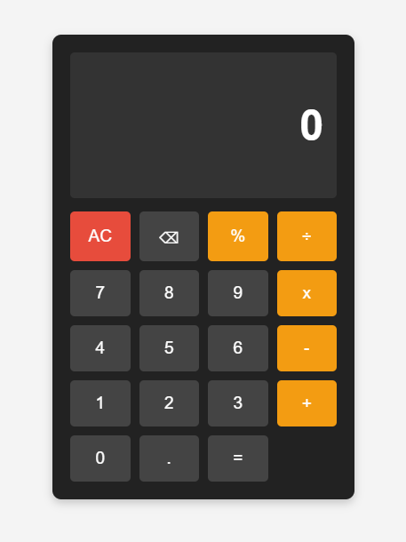

# Simple Calculator 🖩

A simple and interactive calculator built using **HTML, CSS, and JavaScript**. This project is designed to perform basic arithmetic operations with a modern and responsive user interface.

## 🚀 Features
- 📱 **Responsive Design** - Works on all screen sizes.
- 🎨 **Dark-Themed UI** - Clean and modern appearance.
- ➕ **Basic Arithmetic Operations** - Supports Addition, Subtraction, Multiplication, and Division.
- 🔙 **Backspace Functionality** - Delete the last entered digit.
- 🏗️ **Lightweight & Fast** - No external libraries required.

## 📸 Screenshot
 <!-- Add a screenshot of your calculator UI -->

## 🛠️ Technologies Used
- **HTML** - Structure of the calculator.
- **CSS** - Styling and layout.
- **JavaScript** - Functionality and calculations.
